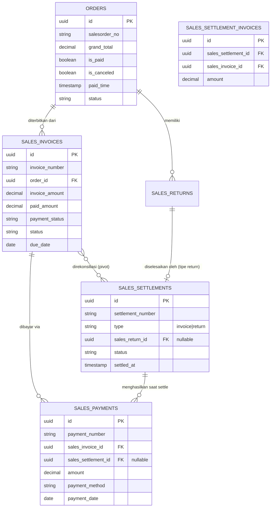
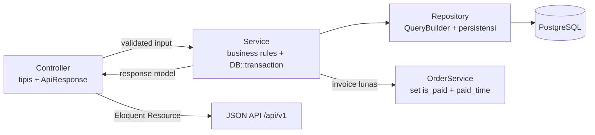

# Technical Design Document — Sales Full Cycle

## Overview

Fitur **Sales Full Cycle** melengkapi siklus penjualan WMS `cilupbah-be` dengan kapabilitas keuangan: penerbitan **Sales Invoice** dari Order, pencatatan **Sales Payment** (termasuk partial & multi-method), **Sales Settlement** (rekonsiliasi pembayaran marketplace) dan **Return Settlement** (penyelesaian finansial dari `SalesReturn` yang sudah ada), serta **Order Enhancements** (set-as-paid, mark-complete, cancel, dan view operasional).

Dokumen ini **fokus backend / API-first**. Tidak ada desain UI/frontend. Seluruh implementasi mengikuti pola wajib proyek:

```
Model (HasUuid7) → Repository (Spatie QueryBuilder) → Service (logika bisnis + DB::transaction) → Controller (tipis, ApiResponse + OA Swagger)
```

### Lingkup & Batasan

- **Modules/Sales**: tambah `SalesInvoice`, `SalesPayment`, `SalesSettlement` (+ pivot `sales_settlement_invoices`).
- **Modules/Order**: tambah operasi keuangan & view operasional pada `OrderService`/`OrderController`. `ALLOWED_TRANSITIONS` existing dihormati.
- Struktur tabel `sales_returns` dan `sales_return_items` **tidak diubah**. Keterkaitan return hanya melalui kolom referensi di `sales_settlements`.
- Document number mengikuti format `PREFIX-YYYYMMDD-0001` auto-increment per hari: `INV-`, `PAY-`, `STL-`, `RST-` (mengikuti pola generator harian yang sudah dipakai modul lain).
- Nilai uang disimpan sebagai `decimal(20,2)` agar konsisten dengan `orders.grand_total`.

### Acuan Konvensi yang Diadopsi

| Aspek | Sumber acuan existing |
|-------|----------------------|
| UUID v7 hex tanpa dash | `App\Traits\HasUuid7` |
| Response API standar | `App\Traits\ApiResponse` (`successResponse`, `successPaginatedResponse`, `errorResponse`) |
| Listing | `QueryBuilder::for(...)` + `FuzzyFilter` (FTS ILIKE) di Repository, `paginate(request('per_page', 10))->appends(request()->query())` |
| Document number harian | pola `generate*No()` di `ReservedStockRepository`, `PicklistRepository`, dst. |
| Transisi status Order | `OrderService::ALLOWED_TRANSITIONS` |
| Status lifecycle dokumen | `DRAFT → ISSUED → PAID → CANCELLED` (selaras gaya `SalesReturn`) |

---

## Architecture

### Diagram Modul & Relasi Data



### Diagram Alir Layer (Sales Invoice & Payment)



### Tanggung Jawab Komponen

- **Controller** (`SalesInvoiceController`, `SalesPaymentController`, `SalesSettlementController`, dan tambahan di `OrderController`): hanya menerima request, validasi dasar (atau FormRequest), memanggil Service, dan mengembalikan `ApiResponse` dengan Eloquent Resource. Dilengkapi atribut OA Swagger.
- **Service** (`SalesInvoiceService`, `SalesPaymentService`, `SalesSettlementService`, perluasan `OrderService`): seluruh logika bisnis keuangan, validasi aturan, dan `DB::transaction` untuk operasi multi-tabel.
- **Repository** (`SalesInvoiceRepository`, `SalesPaymentRepository`, `SalesSettlementRepository`): seluruh query Eloquent/DB, listing via `QueryBuilder`, generator document number, dan `lockForUpdate` untuk operasi finansial.
- **Resource** (`SalesInvoiceResource`, `SalesPaymentResource`, `SalesSettlementResource`): bentuk JSON konsisten, termasuk kolom turunan `outstanding_amount`.

---

## Components and Interfaces

### Modules/Sales — struktur baru

```
Modules/Sales/app/
├── Models/
│   ├── SalesInvoice.php
│   ├── SalesPayment.php
│   └── SalesSettlement.php
├── Repositories/
│   ├── SalesInvoiceRepository.php
│   ├── SalesPaymentRepository.php
│   └── SalesSettlementRepository.php
├── Services/
│   ├── SalesInvoiceService.php
│   ├── SalesPaymentService.php
│   └── SalesSettlementService.php
├── Http/
│   ├── Controllers/
│   │   ├── SalesInvoiceController.php
│   │   ├── SalesPaymentController.php
│   │   └── SalesSettlementController.php
│   ├── Requests/
│   │   ├── StoreSalesInvoiceRequest.php
│   │   ├── UpdateSalesInvoiceRequest.php
│   │   ├── StoreSalesPaymentRequest.php
│   │   ├── StoreSalesSettlementRequest.php
│   │   └── StoreReturnSettlementRequest.php
│   └── Resources/
│       ├── SalesInvoiceResource.php
│       ├── SalesPaymentResource.php
│       └── SalesSettlementResource.php
└── database/migrations/
    ├── ..._create_sales_invoices_table.php
    ├── ..._create_sales_payments_table.php
    ├── ..._create_sales_settlements_table.php
    └── ..._create_sales_settlement_invoices_table.php
```

### Interface Service — SalesInvoiceService

| Method | Tanggung jawab | Requirements |
|--------|----------------|--------------|
| `getAllPaginated()` | listing invoice (search/filter/sort) | 2.1–2.4 |
| `getById(string $id): ?SalesInvoice` | detail + `paid_amount` & `outstanding_amount` | 2.5 |
| `createFromOrder(array $data): SalesInvoice` | generate invoice dari order, set `INV-` number, `UNPAID`, `paid_amount=0`, default due date | 1.1–1.7 |
| `update(string $id, array $data): SalesInvoice` | update field sesuai aturan status | 2.6–2.8 |
| `cancel(string $id): SalesInvoice` | batalkan invoice bila `paid_amount=0` | 2.9–2.10 |
| `getUnpaid()` / `getOverdue()` | view piutang | 3.1–3.2 |
| `getSummary(): array` | total invoice/paid/outstanding | 3.3 |
| `recalculatePaymentState(SalesInvoice $inv): void` | hitung ulang `paid_amount`, `payment_status`, `status` dari sum payments (dipakai bersama Payment/Settlement) | 4.3–4.5, 11.1–11.3 |

### Interface Service — SalesPaymentService

| Method | Tanggung jawab | Requirements |
|--------|----------------|--------------|
| `getAllPaginated()` | listing payment (filter method/invoice, sort) | 5.1–5.3 |
| `getByInvoice(string $invoiceId)` | daftar payment per invoice | 5.4 |
| `record(array $data): SalesPayment` | catat pembayaran dalam transaksi atomik: validasi, simpan, `recalculatePaymentState`, sinkronisasi `Order.is_paid` | 4.1–4.10, 11.1–11.6 |

### Interface Service — SalesSettlementService

| Method | Tanggung jawab | Requirements |
|--------|----------------|--------------|
| `createInvoiceSettlement(array $data): SalesSettlement` | buat `STL-` settlement `PENDING` untuk ≥1 invoice | 6.1 |
| `settle(string $id): SalesSettlement` | catat payment per invoice sesuai nilai, set `SETTLED`, picu pelunasan | 6.2–6.5 |
| `createReturnSettlement(array $data): SalesSettlement` | buat `RST-` settlement untuk `SalesReturn` `COMPLETED` | 7.1–7.2, 7.4–7.5 |
| `settleReturn(string $id): SalesSettlement` | set `SETTLED` + `settled_at` | 7.3 |
| `getAllPaginated()` | listing settlement | 6.6 |

### Interface — OrderService (perluasan)

| Method | Tanggung jawab | Requirements |
|--------|----------------|--------------|
| `setAsPaid(string $id, ?array $data): Order` | set `is_paid=true`, `paid_time=now()`, simpan `payment_method`; idempotent | 8.1–8.4 |
| `markComplete(string $id): Order` | `shipped → completed` saja | 9.1–9.2 |
| `cancelOrder(string $id, array $data): Order` | cancel sesuai transisi diizinkan, set `is_canceled`, `cancel_reason` | 9.3–9.4 |
| `getFailed()` / `getReturned()` / `getUnfulfilled()` | view operasional ter-paginate via QueryBuilder | 10.1–10.4 |
| `markPaidFromInvoice(Order $order, Carbon $time): void` | dipanggil Payment/Settlement saat invoice lunas (R4.6) | 4.6, 11.4 |

> **Catatan transisi:** `completed` adalah status terminal baru. `markComplete` hanya mengizinkan `shipped → completed` (R9.1) dan tidak melewati `validateTransition` Order karena merupakan operasi pasca-shipped khusus. `cancelOrder` tetap menghormati `ALLOWED_TRANSITIONS` existing — `shipped`/`completed` tidak bisa di-cancel (R9.4).

### Generator Document Number (di Repository)

Mengikuti pola existing (`ReservedStockRepository::generateReservedStockNo`). Dijalankan **di dalam** `DB::transaction` dengan `lockForUpdate`/baris terkunci untuk mencegah balapan nomor pada hari yang sama:

```php
public function generateInvoiceNumber(): string
{
    $date   = now()->format('Ymd');
    $prefix = "INV-{$date}-";
    $last = SalesInvoice::where('invoice_number', 'like', "{$prefix}%")
        ->orderByDesc('invoice_number')
        ->lockForUpdate()
        ->value('invoice_number');
    $seq = $last ? (int) substr($last, -4) + 1 : 1;
    return $prefix . str_pad($seq, 4, '0', STR_PAD_LEFT); // INV-YYYYMMDD-0001
}
```

Pola identik untuk `PAY-`, `STL-`, `RST-`.

---

## Data Models

Semua tabel memakai PK `uuid` (kolom `id` bertipe `UUID`, di-generate `HasUuid7`), FK bertipe `UUID`, dan kolom uang `decimal(20,2)`. Mengikuti konvensi modul lain: kolom FK ke `orders`/`sales_returns` bertipe `foreignUuid`.

### Tabel `sales_invoices`

| Kolom | Tipe | Keterangan |
|-------|------|------------|
| `id` | UUID PK | HasUuid7 |
| `invoice_number` | varchar(50) unique | `INV-YYYYMMDD-0001` |
| `order_id` | UUID FK → `orders.id` | `restrictOnDelete` |
| `customer_name` | varchar nullable | disalin dari order (memudahkan search) |
| `invoice_amount` | decimal(20,2) | = `orders.grand_total` saat issue |
| `paid_amount` | decimal(20,2) default 0 | turunan sum payments |
| `payment_status` | varchar(20) default `UNPAID` | `UNPAID`/`PARTIAL`/`PAID` |
| `status` | varchar(20) default `DRAFT` | `DRAFT`/`ISSUED`/`PAID`/`CANCELLED` |
| `due_date` | date nullable | default dari `transaction_date` order |
| `issued_at` | timestamp nullable | waktu penerbitan |
| `notes` | text nullable | field non-finansial |
| `created_by` | varchar(100) nullable | |
| `created_at`/`updated_at` | timestamps | |

Index: `invoice_number` (unique), `order_id`, `payment_status`, `status`, `due_date`. `outstanding_amount` **tidak disimpan** (kolom turunan, dihitung `invoice_amount - paid_amount` di Resource/akses model) untuk menjamin invariant R11.2.

### Tabel `sales_payments`

| Kolom | Tipe | Keterangan |
|-------|------|------------|
| `id` | UUID PK | |
| `payment_number` | varchar(50) unique | `PAY-YYYYMMDD-0001` |
| `sales_invoice_id` | UUID FK → `sales_invoices.id` | `cascadeOnDelete` |
| `sales_settlement_id` | UUID FK → `sales_settlements.id` nullable | diisi bila payment lahir dari settlement |
| `amount` | decimal(20,2) | > 0 |
| `payment_method` | varchar(30) | `cash`/`transfer`/`marketplace`/`va`/`credit_card` |
| `payment_date` | date | |
| `reference` | varchar nullable | nomor referensi eksternal |
| `notes` | text nullable | |
| `created_by` | varchar(100) nullable | |
| timestamps | | |

Index: `payment_number` (unique), `sales_invoice_id`, `payment_method`, `sales_settlement_id`.

### Tabel `sales_settlements`

| Kolom | Tipe | Keterangan |
|-------|------|------------|
| `id` | UUID PK | |
| `settlement_number` | varchar(50) unique | `STL-...` (invoice) / `RST-...` (return) |
| `type` | varchar(20) | `invoice` / `return` |
| `sales_return_id` | UUID FK → `sales_returns.id` nullable | hanya untuk tipe `return` |
| `status` | varchar(20) default `PENDING` | `PENDING`/`SETTLED`/`CANCELLED` |
| `total_amount` | decimal(20,2) default 0 | total nilai settlement |
| `settled_at` | timestamp nullable | waktu penyelesaian |
| `notes` | text nullable | |
| `created_by` | varchar(100) nullable | |
| timestamps | | |

Index: `settlement_number` (unique), `type`, `status`, `sales_return_id`. FK `sales_return_id` ditambahkan **tanpa** mengubah tabel `sales_returns`.

### Tabel pivot `sales_settlement_invoices`

| Kolom | Tipe | Keterangan |
|-------|------|------------|
| `id` | UUID PK | |
| `sales_settlement_id` | UUID FK → `sales_settlements.id` | `cascadeOnDelete` |
| `sales_invoice_id` | UUID FK → `sales_invoices.id` | `restrictOnDelete` |
| `amount` | decimal(20,2) | nilai settlement untuk invoice tsb |
| timestamps | | |

Index gabungan unik: (`sales_settlement_id`, `sales_invoice_id`).

### Relasi Eloquent

- `SalesInvoice` belongsTo `Order`; hasMany `SalesPayment`; belongsToMany `SalesSettlement` (pivot). Accessor `getOutstandingAmountAttribute()` = `invoice_amount - paid_amount`.
- `SalesPayment` belongsTo `SalesInvoice`; belongsTo `SalesSettlement` (nullable).
- `SalesSettlement` belongsTo `SalesReturn` (nullable); belongsToMany `SalesInvoice` (pivot); hasMany `SalesPayment`.

### Endpoint RESTful (`/api/v1`, middleware `auth:sanctum`)

**Sales Invoice** (`Modules/Sales/routes/api.php`)
- `GET    /api/v1/sales/invoices` — listing (search/filter/sort)
- `GET    /api/v1/sales/invoices/unpaid` — R3.1
- `GET    /api/v1/sales/invoices/overdue` — R3.2
- `GET    /api/v1/sales/invoices/summary` — R3.3
- `GET    /api/v1/sales/invoices/{id}` — detail
- `POST   /api/v1/sales/invoices` — generate dari order
- `PUT    /api/v1/sales/invoices/{id}` — update
- `POST   /api/v1/sales/invoices/{id}/cancel` — cancel

**Sales Payment**
- `GET    /api/v1/sales/payments` — listing
- `GET    /api/v1/sales/invoices/{id}/payments` — payment per invoice (R5.4)
- `POST   /api/v1/sales/payments` — catat pembayaran

**Sales Settlement**
- `GET    /api/v1/sales/settlements` — listing
- `GET    /api/v1/sales/settlements/{id}` — detail
- `POST   /api/v1/sales/settlements` — buat invoice settlement (R6.1)
- `POST   /api/v1/sales/settlements/{id}/settle` — settle (R6.2)
- `POST   /api/v1/sales/return-settlements` — buat return settlement (R7.1)
- `POST   /api/v1/sales/return-settlements/{id}/settle` — settle return (R7.3)

**Order Enhancements** (`Modules/Order/routes/api.php`)
- `POST   /api/v1/orders/{id}/set-as-paid` — R8
- `POST   /api/v1/orders/{id}/mark-complete` — R9.1
- `POST   /api/v1/orders/{id}/cancel` — R9.3
- `GET    /api/v1/orders/failed` — R10.1
- `GET    /api/v1/orders/returned` — R10.2
- `GET    /api/v1/orders/unfulfilled` — R10.3

> Catatan routing: rute statik (`/unpaid`, `/overdue`, `/summary`, `/failed`, dst.) didaftarkan **sebelum** rute `{id}` agar tidak tertangkap wildcard.

---

## Correctness Properties

*Sebuah property adalah karakteristik atau perilaku yang harus selalu benar di seluruh eksekusi valid sistem — pernyataan formal tentang apa yang seharusnya dilakukan sistem. Property menjadi jembatan antara spesifikasi yang dapat dibaca manusia dan jaminan kebenaran yang dapat diverifikasi mesin.*

Properti berikut diturunkan dari prework. Properti redundan telah digabung (lihat Property Reflection di prework): invariant pembayaran, pemetaan status, no-overpayment, keterkaitan order, dan atomicity masing-masing menjadi satu properti komprehensif.

### Property 1: Invariant Paid_Amount sama dengan total pembayaran

*For any* Sales_Invoice dan *for any* urutan pencatatan Sales_Payment valid (yang tidak melampaui Invoice_Amount), `Paid_Amount` invoice selalu sama dengan jumlah `amount` seluruh Sales_Payment tercatat pada invoice tersebut.

**Validates: Requirements 4.1, 4.3, 11.1**

### Property 2: Pemetaan Invoice_Payment_Status dari Paid_Amount

*For any* Sales_Invoice, `Invoice_Payment_Status` selalu mengikuti `Paid_Amount`: bernilai `UNPAID` ketika `Paid_Amount = 0`, `PARTIAL` ketika `0 < Paid_Amount < Invoice_Amount`, dan `PAID` (serta `Invoice_Status = PAID`) ketika `Paid_Amount = Invoice_Amount`.

**Validates: Requirements 4.4, 4.5**

### Property 3: Pelunasan invoice menandai Order lunas

*For any* Sales_Invoice yang `Invoice_Payment_Status`-nya menjadi `PAID`, Order asal selalu memiliki `is_paid = true` dan `paid_time` terisi.

**Validates: Requirements 4.6, 6.3, 11.4**

### Property 4: Tidak pernah terjadi overpayment

*For any* Sales_Invoice dan *for any* urutan pencatatan pembayaran maupun penyelesaian settlement, setiap operasi yang akan menyebabkan `Paid_Amount` melebihi `Invoice_Amount` ditolak, sehingga `Paid_Amount` tidak pernah melebihi `Invoice_Amount`.

**Validates: Requirements 4.7, 6.4, 11.3**

### Property 5: Invariant Outstanding_Amount

*For any* Sales_Invoice pada keadaan apa pun, `Outstanding_Amount` selalu sama dengan `Invoice_Amount` dikurangi `Paid_Amount`.

**Validates: Requirements 2.5, 11.2**

### Property 6: Penyelesaian settlement mendistribusikan nilai per invoice

*For any* Sales_Settlement bertipe invoice dengan beberapa Sales_Invoice dan nilai per invoice yang tidak melampaui Outstanding masing-masing, setelah `settle` setiap Sales_Invoice memperoleh kenaikan `Paid_Amount` tepat sebesar nilai settlement-nya dan `Settlement_Status` menjadi `SETTLED`.

**Validates: Requirements 6.2**

### Property 7: Atomicity pencatatan pembayaran dan settlement

*For any* operasi pencatatan Sales_Payment atau penyelesaian Sales_Settlement yang gagal di tengah proses, seluruh perubahan dibatalkan sehingga `Paid_Amount`, jumlah Sales_Payment, dan `Order.is_paid` tetap sama persis seperti sebelum operasi (tidak ada data parsial).

**Validates: Requirements 11.5, 11.6**

### Property 8: Invoice_Amount mengikuti grand_total Order

*For any* Order valid (tidak dibatalkan, belum punya invoice aktif), Sales_Invoice yang diterbitkan memiliki `Invoice_Amount` sama dengan `grand_total` Order asal.

**Validates: Requirements 1.1**

### Property 9: Format dan urutan Document_Number per hari

*For any* sejumlah dokumen sejenis (invoice/payment/settlement) yang dibuat pada hari yang sama, setiap Document_Number mengikuti format `PREFIX-YYYYMMDD-NNNN`, bersifat unik, dan nomor urut bertambah satu secara berurutan.

**Validates: Requirements 1.2, 4.2**

### Property 10: Due_Date default dari transaction_date

*For any* Order yang invoice-nya diterbitkan tanpa `due_date` eksplisit, `Due_Date` yang ditetapkan sama dengan hasil aturan default sistem terhadap `transaction_date` Order.

**Validates: Requirements 1.3**

### Property 11: Keadaan awal invoice baru

*For any* Sales_Invoice yang baru dibuat, `Invoice_Payment_Status` bernilai `UNPAID` dan `Paid_Amount` bernilai 0.

**Validates: Requirements 1.4**

### Property 12: Update non-finansial diizinkan saat bukan UNPAID

*For any* Sales_Invoice yang `Invoice_Payment_Status`-nya bukan `UNPAID`, pembaruan field non-finansial (catatan/deskripsi) tersimpan tanpa mengubah `Invoice_Amount` maupun `Due_Date`.

**Validates: Requirements 2.8**

### Property 13: Pembatalan invoice tanpa pembayaran

*For any* Sales_Invoice yang `Paid_Amount`-nya 0, operasi cancel menetapkan `Invoice_Status` ke `CANCELLED`.

**Validates: Requirements 2.9**

### Property 14: View unpaid hanya UNPAID/PARTIAL

*For any* kumpulan Sales_Invoice, hasil view unpaid berisi tepat seluruh invoice yang `Invoice_Payment_Status`-nya `UNPAID` atau `PARTIAL`, tanpa kelebihan maupun kekurangan.

**Validates: Requirements 3.1**

### Property 15: View overdue memenuhi predikat jatuh tempo

*For any* kumpulan Sales_Invoice, hasil view overdue berisi tepat invoice yang `Due_Date`-nya lebih awal dari tanggal saat ini dan `Invoice_Payment_Status`-nya bukan `PAID`.

**Validates: Requirements 3.2**

### Property 16: Summary menjumlahkan invoice non-CANCELLED

*For any* kumpulan Sales_Invoice, summary mengembalikan total `Invoice_Amount`, total `Paid_Amount`, dan total `Outstanding_Amount` yang sama dengan penjumlahan atas seluruh invoice ber-`Invoice_Status` bukan `CANCELLED`, dengan total outstanding sama dengan total invoice dikurangi total paid.

**Validates: Requirements 3.3**

### Property 17: Daftar pembayaran per invoice tepat sasaran

*For any* Sales_Invoice, daftar pembayaran yang dikembalikan untuk invoice tersebut berisi tepat seluruh Sales_Payment yang `sales_invoice_id`-nya merujuk invoice itu.

**Validates: Requirements 5.4**

### Property 18: Set-as-paid menandai Order lunas

*For any* Order yang `is_canceled`-nya false dan belum dibayar, operasi set-as-paid menetapkan `is_paid = true`, mengisi `paid_time` dengan waktu saat ini, dan menyimpan `payment_method` bila diberikan.

**Validates: Requirements 8.1, 8.2**

### Property 19: Idempotensi set-as-paid

*For any* Order yang sudah `is_paid = true`, pemanggilan set-as-paid berikutnya tidak mengubah `paid_time` yang sudah ada.

**Validates: Requirements 8.3**

### Property 20: Mark-complete dari shipped

*For any* Order yang `status`-nya `shipped`, operasi mark-complete menetapkan `status` ke `completed`.

**Validates: Requirements 9.1**

### Property 21: Cancel pada status yang diizinkan

*For any* Order yang `status`-nya termasuk transisi yang diizinkan ke `cancelled` (`pending`, `reserved`, `picked`, `packed`), operasi cancel menetapkan `status` ke `cancelled`, `is_canceled` ke true, dan menyimpan `cancel_reason`.

**Validates: Requirements 9.3**

### Property 22: View failed hanya Order dibatalkan

*For any* kumpulan Order, hasil view failed/cancelled berisi tepat Order yang `is_canceled`-nya true.

**Validates: Requirements 10.1**

### Property 23: View returned hanya Order yang punya return

*For any* kumpulan Order, hasil view returned berisi tepat Order yang memiliki minimal satu Sales_Return terkait.

**Validates: Requirements 10.2**

### Property 24: View unfulfilled memenuhi predikat

*For any* kumpulan Order, hasil view unfulfilled berisi tepat Order yang `status`-nya `pending` atau `reserved` dan `is_canceled`-nya false.

**Validates: Requirements 10.3**

---

## Error Handling

Seluruh error dikembalikan via `App\Traits\ApiResponse::errorResponse(message, code)` dengan pesan Bahasa Indonesia yang deskriptif. Service melempar `\Exception` (atau exception domain khusus) yang ditangkap Controller, mengikuti pola `SalesReturnController` yang ada.

| Kondisi | HTTP | Pesan contoh | Requirement |
|---------|------|--------------|-------------|
| `order_id` tidak ditemukan | 404 | "Order tidak ditemukan." | 1.5 |
| Order `is_canceled` | 422 | "Order sudah dibatalkan, tidak dapat diterbitkan invoice." | 1.6 |
| Sudah ada invoice aktif | 422 | "Order ini sudah memiliki invoice aktif." | 1.7 |
| Ubah field finansial saat bukan UNPAID | 422 | "Invoice_Amount dan Due_Date tidak dapat diubah karena invoice sudah memiliki pembayaran." | 2.7 |
| Cancel invoice ber-pembayaran | 422 | "Invoice tidak dapat dibatalkan karena sudah memiliki pembayaran." | 2.10 |
| Overpayment (payment/settlement) | 422 | "Nilai pembayaran melebihi sisa tagihan invoice." | 4.7, 6.4 |
| amount <= 0 | 422 | "Nilai pembayaran harus lebih besar dari 0." | 4.8 |
| Payment ke invoice CANCELLED | 422 | "Tidak dapat mencatat pembayaran pada invoice yang dibatalkan." | 4.9 |
| Payment_Method tidak didukung | 422 | "Metode pembayaran tidak didukung." | 4.10 |
| Settle settlement sudah SETTLED | 422 | "Settlement sudah diselesaikan." | 6.5 |
| Return bukan COMPLETED | 422 | "Sales return harus berstatus COMPLETED untuk diselesaikan." | 7.2 |
| Return settlement aktif sudah ada | 422 | "Sales return ini sudah memiliki settlement aktif." | 7.4 |
| set-as-paid order canceled | 422 | "Order yang dibatalkan tidak dapat ditandai lunas." | 8.4 |
| mark-complete bukan shipped | 422 | "Order harus berstatus shipped untuk diselesaikan." | 9.2 |
| cancel order shipped/completed | 422 | "Order yang sudah dikirim atau selesai tidak dapat dibatalkan." | 9.4 |

**Atomicity & konkurensi (R11.5–R11.6):** seluruh operasi yang menyentuh beberapa baris/tabel (record payment, settle, set-as-paid) dibungkus `DB::transaction`. Baris invoice dikunci `lockForUpdate` selama perhitungan ulang `Paid_Amount` untuk mencegah balapan (race) dan double-pay. Bila exception terjadi, transaksi otomatis rollback sehingga tidak ada data parsial.

---

## Testing Strategy

### Pendekatan Ganda

- **Property-based tests**: memverifikasi invariant keuangan & properti universal (Property 1–24) lintas banyak input acak.
- **Unit/example tests**: contoh konkret, integrasi antar-komponen, dan edge case/error condition.
- **Edge-case tests**: kondisi penolakan yang diidentifikasi di prework (R1.5–1.7, 2.7, 2.10, 4.8–4.10, 6.5, 7.2, 7.4, 9.2, 9.4) — diuji eksplisit sebagai contoh negatif sekaligus dijadikan ruang generator pada property test terkait.

### Library & Konfigurasi Property-Based Testing

- Library: **`pestphp/pest-plugin-faker`** dipakai bersama generator kustom, atau **`innmind/black-box`** sebagai PBT engine untuk PHP. Tidak mengimplementasikan PBT dari nol.
- Setiap property test menjalankan **minimum 100 iterasi**.
- Setiap test diberi tag komentar yang merujuk properti desain:
  - Format: `// Feature: sales-full-cycle, Property {number}: {property_text}`
- Setiap correctness property diimplementasikan dengan **satu** property-based test.
- Database test memakai transaksi/`RefreshDatabase`; AWS/queue tidak terlibat sehingga PBT in-memory/DB cepat dan layak 100+ iterasi.

**Generator yang diperlukan:**
- `orderGenerator`: Order dengan `grand_total` acak (termasuk desimal & nilai besar), `status`, `is_canceled`, `transaction_date` acak.
- `invoiceGenerator`: Sales_Invoice pada berbagai state (UNPAID/PARTIAL/PAID/CANCELLED) dengan `paid_amount` konsisten.
- `paymentSequenceGenerator`: urutan pembayaran yang menjaga `sum <= invoice_amount`, plus varian yang sengaja melampaui untuk Property 4.
- `paymentMethodGenerator`: campuran method valid & invalid (R4.10).
- `settlementGenerator`: settlement multi-invoice dengan distribusi nilai per invoice.

### Pemetaan Property → Test

| Property | Fokus uji |
|----------|-----------|
| 1, 5 | invariant `paid_amount = Σ payments`, `outstanding = amount - paid` setelah tiap operasi |
| 2 | pemetaan status dari `paid_amount` |
| 3 | pelunasan → `Order.is_paid` |
| 4 | penolakan overpayment via payment & settlement; invariant `paid ≤ amount` |
| 6 | distribusi nilai settlement per invoice |
| 7 | rollback saat kegagalan disuntik (mis. exception/nomor duplikat), state tak berubah |
| 8, 10, 11 | nilai/keadaan invoice saat penerbitan |
| 9 | format & increment Document_Number per hari |
| 12, 13 | aturan update & cancel |
| 14, 15, 16 | korektness view unpaid/overdue/summary |
| 17 | payment per invoice |
| 18, 19 | set-as-paid & idempotensi |
| 20, 21 | mark-complete & cancel transisi |
| 22, 23, 24 | view failed/returned/unfulfilled |

### Integration / Example Tests (non-PBT)

- Pagination default 10 & `per_page` (R2.1, 5.1, 6.6, 10.x).
- Search `?search=`, filter, dan sort via QueryBuilder (R2.2–2.4, 5.2–5.3, 10.4).
- Pembuatan settlement invoice/return & transisi `settled_at` (R6.1, 7.1, 7.3).
- Smoke: review migrasi memastikan tabel `sales_returns`/`sales_return_items` tidak diubah strukturnya (R7.5).

### Catatan PBT

Fokus PBT adalah **lapisan logika Service** (perhitungan keuangan murni & transisi state) — bagian yang paling diuntungkan oleh variasi input. Listing/filtering yang merupakan mekanik `spatie/laravel-query-builder` cukup diuji dengan contoh karena perilakunya tidak bervariasi bermakna terhadap domain input dan sudah teruji oleh paket.
