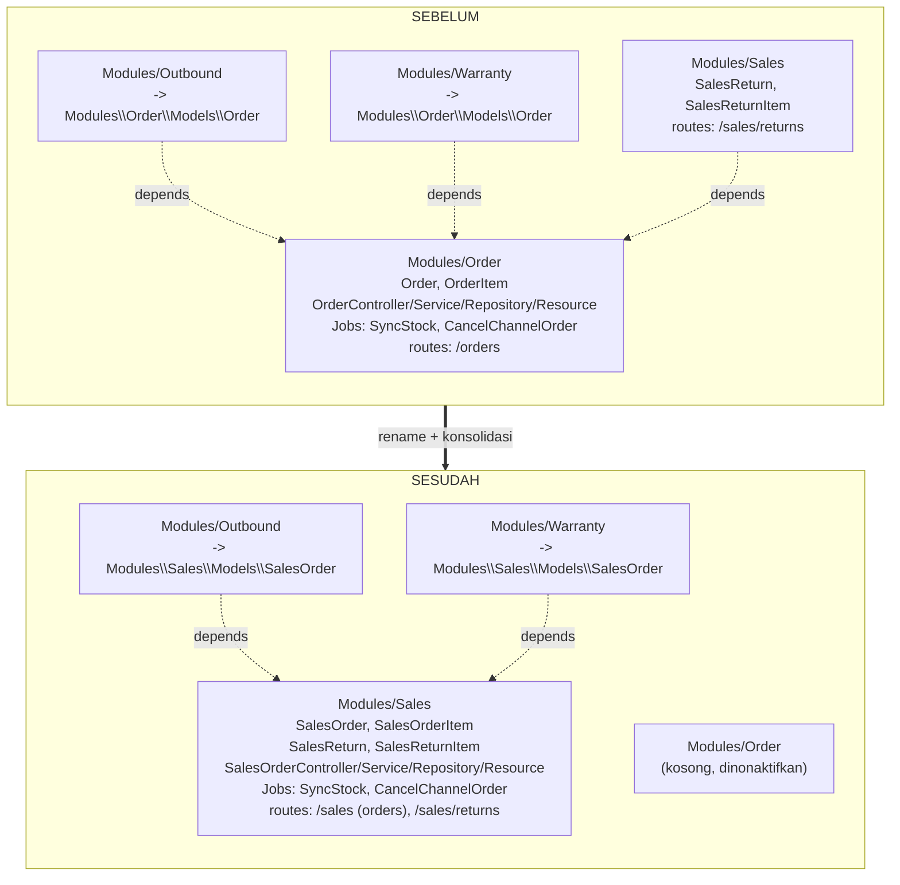
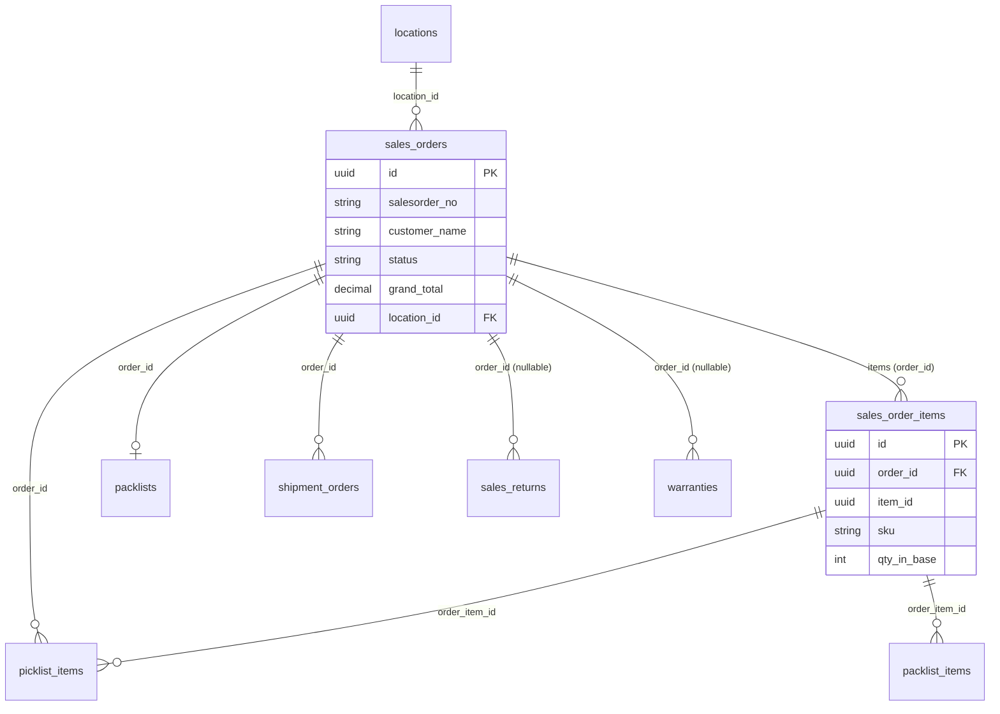

# Design Document: sales-order-rename

## Overview

Fitur ini melakukan refactoring penamaan domain penjualan agar simetris dengan domain Purchase. Inti pekerjaan adalah me-rename entitas `Order` -> `SalesOrder` dan `OrderItem` -> `SalesOrderItem`, mengonsolidasikan keduanya ke modul `Sales` (yang saat ini hanya berisi `SalesReturn`), me-rename tabel database `orders` -> `sales_orders` dan `order_items` -> `sales_order_items`, serta mengganti prefix route API dari `/orders` menjadi `/sales`.

Sifat fitur ini adalah **refactoring tanpa perubahan perilaku fungsional (no functional regression)**. Tujuan utama adalah menyelaraskan penamaan kode + skema, sambil mempertahankan:

- Kontrak payload request dan struktur respons JSON yang setara (hanya path yang berubah).
- Relasi Eloquent dan integritas foreign key.
- Standar proyek (AGENTS.md): Service-Repository pattern, `ApiResponse` + Eloquent Resources, Spatie Query Builder di Repository, default pagination 10 dengan `per_page`, dan macro `allowedSearch` FTS PostgreSQL.

### Keputusan Final (Basis Desain, Bukan Opsi Terbuka)

Keputusan berikut sudah ditetapkan user dan menjadi landasan desain:

| Keputusan | Nilai | Dampak |
|---|---|---|
| **Table_Strategy** | `Rename_Table` | Rename tabel fisik + migration rename & rollback (Requirement 3 & 8) |
| **Nama tabel** | `orders` -> `sales_orders`, `order_items` -> `sales_order_items` | Properti `$table` eksplisit pada model baru |
| **Foreign key** | Tetap bernama `order_id` | Hanya tabel acuan (`referenced table`) berubah; nama kolom FK tidak berubah |
| **Lokasi class** | Dikonsolidasikan ke `Modules/Sales` | Simetri dengan domain Purchase |
| **Prefix route** | `/orders` -> `/sales` | Breaking change path; payload & skema respons tetap |

### Keputusan Konsolidasi Modul: Konsolidasi ke `Modules/Sales` (Rekomendasi, Dipilih)

Requirement 1.3 mewajibkan `SalesOrder` dan `SalesOrderItem` berada di `Modules/Sales`. Dua arah dipertimbangkan:

**Opsi A — Konsolidasi ke `Modules/Sales` (DIPILIH):**
- Memenuhi Requirement 1.3 secara langsung dan mencapai tujuan simetri (`SalesOrder` + `SalesReturn` berkumpul di domain Sales, mirip `PurchaseOrder` di domain Purchase).
- Trade-off: memindahkan banyak file lintas modul (Models, Controller, Service, Repository, Resource, Jobs, Exceptions, routes, migrations, seeder) dan memperbarui seluruh namespace `Modules\Order\*` -> `Modules\Sales\*`.
- Modul `Order` menjadi kosong dan dinonaktifkan/dihapus di akhir.

**Opsi B — Pertahankan `Modules/Order`, rename class saja:**
- Lebih sedikit perpindahan file, tetapi **tidak** memenuhi Requirement 1.3 (class tetap berada di modul `Order`) dan tidak mencapai simetri domain. Ditolak.

Konsekuensi memilih Opsi A: namespace baru adalah `Modules\Sales\Models\SalesOrder` dan `Modules\Sales\Models\SalesOrderItem`. Seluruh komponen lapisan aplikasi Order ikut pindah ke `Modules\Sales\*` namun mempertahankan tanggung jawabnya (lihat bagian Components and Interfaces).

### Urutan Aman: Kode vs Database

Prinsip: **rename kode dan rename DB harus konsisten pada satu titik deploy**, karena model baru mendeklarasikan `$table = 'sales_orders'`. Jika kode di-deploy sebelum migration jalan (atau sebaliknya), model akan menunjuk tabel yang belum ada. Urutan aman:

1. Siapkan seluruh perubahan kode (model, namespace, referensi, route, test) dalam satu unit perubahan.
2. Migration rename tabel disertakan dalam unit yang sama.
3. Saat deploy: jalankan `migrate` (rename tabel) lalu kode baru aktif — keduanya dirilis bersama (atomic release). Migration rename tabel di PostgreSQL bersifat metadata-only (cepat, tanpa rewrite data).
4. Rollback: `migrate:rollback` mengembalikan nama tabel, dan revert kode mengembalikan namespace lama.

Detail sequence ada pada bagian "Sequence Eksekusi Aman & Rollback".

## Architecture

### Struktur Modul: Sebelum vs Sesudah



### ERD Relasi Penjualan (Sesudah Rename)

Catatan: kolom FK tetap bernama `order_id`; hanya tabel acuan yang berganti nama menjadi `sales_orders` / `sales_order_items`.



### Layering (Tidak Berubah)

Layering tetap mengikuti Service-Repository pattern AGENTS.md. Hanya nama class & namespace yang berubah:

```
HTTP Request -> SalesOrderController (ApiResponse, validasi)
             -> SalesOrderService (logika bisnis, transaksi, jobs)
             -> SalesOrderRepository (QueryBuilder, allowedSearch, paginate per_page)
             -> SalesOrder / SalesOrderItem (Eloquent, $table eksplisit)
             -> SalesOrderResource / SalesOrderItemResource (skema respons)
```

## Components and Interfaces

### Pemetaan Rename Komponen

Seluruh komponen modul `Order` dipindahkan ke `Modules/Sales` dengan namespace `Modules\Sales\*`. Nama class entitas penjualan inti di-rename; nama class controller/service/repository/resource diselaraskan ke `SalesOrder*`.

| Sebelum (Modules\Order) | Sesudah (Modules\Sales) | Catatan |
|---|---|---|
| `Models\Order` | `Models\SalesOrder` | `$table = 'sales_orders'` |
| `Models\OrderItem` | `Models\SalesOrderItem` | `$table = 'sales_order_items'` |
| `Http\Controllers\OrderController` | `Http\Controllers\SalesOrderController` | Logika tetap, hanya tipe & resource |
| `Services\OrderService` | `Services\SalesOrderService` | Logika bisnis identik |
| `Services\StockService` | `Services\StockService` | Pindah namespace; logika identik |
| `Repositories\OrderRepository` | `Repositories\SalesOrderRepository` | QueryBuilder tetap |
| `Http\Resources\OrderResource` | `Http\Resources\SalesOrderResource` | Field respons identik |
| `Http\Resources\OrderItemResource` | `Http\Resources\SalesOrderItemResource` | Field respons identik |
| `Jobs\SyncStockJob` | `Jobs\SyncStockJob` | Pindah namespace; logika identik |
| `Jobs\CancelChannelOrderJob` | `Jobs\CancelChannelOrderJob` | Pindah namespace; logika identik |
| `Jobs\ProcessMarketplaceOrder` | `Jobs\ProcessMarketplaceOrder` | Pindah namespace |
| `Jobs\AdminAlertJob` | `Jobs\AdminAlertJob` | Pindah namespace |
| `Exceptions\*OrderException` | `Exceptions\*OrderException` | Pindah namespace; pesan boleh tetap |
| `Providers\OrderServiceProvider` | (digabung ke `SalesServiceProvider`) | Route Sales sudah ada |
| `routes/api.php` (`/orders`) | digabung ke `Modules/Sales/routes/api.php` (`/sales`) | Lihat bagian Routing |
| `database/seeders/OrderDatabaseSeeder` | `database/seeders/SalesDatabaseSeeder` (gabung) | |

### Perubahan Model

#### SalesOrder (dari Order)

Perubahan kunci:
- Namespace `Modules\Sales\Models`.
- Tambahkan properti `$table = 'sales_orders'` secara eksplisit. Tanpa ini Eloquent akan menebak tabel `sales_orders` dari nama class `SalesOrder` — kebetulan cocok, namun deklarasi eksplisit dijadikan standar agar tidak bergantung pada konvensi dan agar intent jelas.
- Relasi `items()` tetap `hasMany(SalesOrderItem::class)`. **Argumen FK eksplisit wajib**: karena konvensi Eloquent menurunkan nama FK dari nama model induk (`SalesOrder` -> `sales_order_id`), sedangkan kolom FK tetap `order_id`, maka relasi harus menulis FK eksplisit:

```php
namespace Modules\Sales\Models;

use Illuminate\Database\Eloquent\Model;
use Illuminate\Database\Eloquent\Relations\{HasMany, HasOne, BelongsTo};
use App\Traits\HasUuid7;

class SalesOrder extends Model
{
    use HasUuid7;

    protected $table = 'sales_orders';

    protected $fillable = [ /* identik dengan Order saat ini */ ];
    protected $casts = [ /* identik */ ];

    public function items(): HasMany
    {
        // FK eksplisit 'order_id' karena kolom tidak ikut di-rename
        return $this->hasMany(SalesOrderItem::class, 'order_id');
    }

    public function picklistItems(): HasMany
    {
        return $this->hasMany(\Modules\Outbound\Models\PicklistItem::class, 'order_id');
    }

    public function packlist(): HasOne
    {
        return $this->hasOne(\Modules\Outbound\Models\Packlist::class, 'order_id');
    }

    public function shipmentOrders(): HasMany
    {
        return $this->hasMany(\Modules\Outbound\Models\ShipmentOrder::class, 'order_id');
    }

    public function location(): BelongsTo
    {
        return $this->belongsTo(\Modules\Warehouse\Models\Location::class);
    }
}
```

> **Alasan FK eksplisit**: Sebelum rename, model bernama `Order`, sehingga Eloquent menurunkan FK default `order_id` — kebetulan sama dengan kolom nyata, jadi argumen FK tidak perlu ditulis. Setelah rename menjadi `SalesOrder`, default Eloquent berubah menjadi `sales_order_id`. Karena kolom FK fisik tetap `order_id`, **setiap** relasi `hasMany`/`hasOne`/`belongsTo` yang menyentuh `sales_orders`/`sales_order_items` harus menyebut `order_id` secara eksplisit agar relasi tidak putus.

#### SalesOrderItem (dari OrderItem)

```php
namespace Modules\Sales\Models;

class SalesOrderItem extends Model
{
    use HasUuid7;

    protected $table = 'sales_order_items';

    protected $fillable = [ 'order_id', /* ...identik... */ ];

    public function order(): BelongsTo
    {
        // FK eksplisit; foreign key tetap 'order_id', menunjuk SalesOrder
        return $this->belongsTo(SalesOrder::class, 'order_id');
    }

    public function product(): BelongsTo
    {
        return $this->belongsTo(\Modules\Product\Models\Product::class, 'item_id');
    }

    public function inventory(): HasMany
    {
        return $this->hasMany(\Modules\Inventory\Models\Inventory::class, 'item_id', 'item_id');
    }
}
```

### Repository

`SalesOrderRepository` identik secara perilaku dengan `OrderRepository`, dengan penyesuaian:
- `use Modules\Sales\Models\SalesOrder;`
- `QueryBuilder::for(SalesOrder::class)` — tetap `allowedSearch('customer_name', 'salesorder_no')`, `allowedFilters`, `allowedSorts`, `allowedIncludes('items')`.
- Pertahankan `->paginate(request('per_page', 10))->appends(request()->query())` (AGENTS.md §5).
- Query DB facade hardcoded `DB::table('orders')` dan `DB::table('order_items')` di `upsertOrderBySalesOrderNo` dan `syncOrderItems` **harus diganti** menjadi `DB::table('sales_orders')` dan `DB::table('sales_order_items')`. Ini titik kritis: string tabel literal tidak ikut ter-rename otomatis oleh perubahan model.

### Controller

`SalesOrderController` mempertahankan seluruh method (`index`, `store`, `show`, `update`, `destroy`) dan perilakunya:
- Tetap `use ApiResponse` dan mengembalikan `successResponse` / `successPaginatedResponse` (AGENTS.md §2).
- Transform paginator via Resource sebelum response (pola `getCollection()->transform(...)`).
- Type hint `Order` -> `SalesOrder`, resource `OrderResource` -> `SalesOrderResource`.
- Anotasi OpenAPI (`#[OA\...]`) diperbarui: schema name dan `path` (`/api/v1/orders` -> `/api/v1/sales`). Nama field schema respons tidak berubah (Requirement 5.6).

### Service

`SalesOrderService` memindahkan logika tanpa perubahan alur: idempotency cache key, transisi status (`ALLOWED_TRANSITIONS`), reserve/pick/ship/release stock, `upsertFromChannel`. Penyesuaian:
- `use Modules\Sales\Models\SalesOrder;` dan type hint `Order` -> `SalesOrder`.
- `use Modules\Sales\Jobs\{SyncStockJob, CancelChannelOrderJob};`.
- `DB::table('orders')` literal di `upsertFromChannel` -> `DB::table('sales_orders')`.
- Cache key idempotency (`order:done:...`) boleh dipertahankan apa adanya (bukan kontrak eksternal), namun didokumentasikan agar tidak membingungkan.

### Resource

`SalesOrderResource` dan `SalesOrderItemResource` mempertahankan **persis** struktur array `toArray()` (nama field, casting, blok `shipping`, `items`) agar API_Consumer menerima skema setara (Requirement 5.5, 5.6). Hanya nama class, namespace, dan `schema:` OpenAPI yang berubah.

### Providers & Autoload

- Modul `Sales` sudah memiliki `SalesServiceProvider`, `RouteServiceProvider`, `EventServiceProvider`. Tidak perlu membuat provider baru; cukup pastikan route Sales memuat route penjualan (sudah otomatis via `module_path`).
- `Modules\Order\Providers\OrderServiceProvider` dihapus bersama modul `Order`.
- Autoload: karena seluruh file pindah ke `Modules/Sales/app`, namespace `Modules\Sales\` sudah terdaftar di `Modules/Sales/composer.json`. Tidak ada penambahan PSR-4 baru yang diperlukan. Setelah pemindahan file, jalankan `composer dump-autoload` untuk membersihkan cache autoloader (Requirement 1.5).

## Data Models

### Strategi Namespace & Autoload

- **PSR-4**: `Modules\Sales\` -> `Modules/Sales/app/` (sudah ada di `Modules/Sales/composer.json`). Class baru otomatis ter-autoload setelah file diletakkan pada path yang benar, contoh `Modules/Sales/app/Models/SalesOrder.php`.
- **module.json**: tidak berubah (provider Sales sudah terdaftar). `module.json` modul `Order` akan dihapus saat modul dinonaktifkan.
- **Penonaktifan modul Order**: setelah semua file dipindah dan tidak ada referensi tersisa, hapus direktori `Modules/Order` (atau nonaktifkan via `php artisan module:disable Order`). Pastikan tidak ada entri PSR-4 yang menggantung.
- **Cache**: `composer dump-autoload`, lalu `php artisan optimize:clear` (config/route/cache) agar binding & route ter-refresh.

### Skema Tabel (Sesudah Rename)

| Tabel lama | Tabel baru | Kolom FK | Acuan baru |
|---|---|---|---|
| `orders` | `sales_orders` | — | — |
| `order_items` | `sales_order_items` | `order_id` | `sales_orders.id` |
| `picklist_items` | (tetap) | `order_id`, `order_item_id` | `sales_orders.id`, `sales_order_items.id` |
| `packlists` | (tetap) | `order_id` | `sales_orders.id` |
| `shipment_orders` | (tetap) | `order_id` | `sales_orders.id` |
| `sales_returns` | (tetap) | `order_id` (nullable) | `sales_orders.id` |
| `warranties` | (tetap) | `order_id` (nullable) | `sales_orders.id` |

### Migration Rename Tabel + Rollback

Karena tabel `sales_orders` dan `sales_order_items` direferensikan oleh banyak FK di tabel lain, urutan operasi harus menjaga integritas. PostgreSQL `ALTER TABLE ... RENAME` bersifat metadata-only dan **otomatis mempertahankan FK yang sudah ada** (constraint mengikuti tabel yang di-rename tanpa perlu drop/re-add). Namun, karena beberapa FK dibuat dengan nama constraint yang diturunkan dari nama tabel lama, desain memilih pendekatan eksplisit drop -> rename -> re-add untuk kontrol penuh dan rollback yang deterministik.

Migration baru ditempatkan di `Modules/Sales/database/migrations` dengan timestamp setelah seluruh migration pembuatan tabel terkait (agar `up()` berjalan saat tabel & FK sudah ada).

**Urutan `up()` (drop FK -> rename table -> re-add FK):**

1. Drop FK `order_id`/`order_item_id` pada tabel anak yang menunjuk `orders`/`order_items`:
   - `order_items.order_id` (self child), `picklist_items.order_id`, `picklist_items.order_item_id`, `packlists.order_id`, `shipment_orders.order_id`, `sales_returns.order_id`, `warranties.order_id`, `packlist_items.order_item_id`.
2. Rename tabel: `orders` -> `sales_orders`, `order_items` -> `sales_order_items`.
3. Re-add seluruh FK `order_id` -> `sales_orders.id` dan `order_item_id` -> `sales_order_items.id`, dengan perilaku on-delete yang sama seperti definisi awal:
   - `sales_order_items.order_id` -> `sales_orders` `cascadeOnDelete`
   - `picklist_items.order_id` -> `sales_orders` `restrictOnDelete`; `picklist_items.order_item_id` -> `sales_order_items` `restrictOnDelete`
   - `packlists.order_id` -> `sales_orders` `restrictOnDelete`
   - `packlist_items.order_item_id` -> `sales_order_items` `restrictOnDelete`
   - `shipment_orders.order_id` -> `sales_orders` `restrictOnDelete`
   - `sales_returns.order_id` -> `sales_orders` `nullOnDelete`
   - `warranties.order_id` -> `sales_orders` `nullOnDelete`

**Urutan `down()` (kebalikan, deterministik):**

1. Drop seluruh FK yang dibuat di langkah 3.
2. Rename balik: `sales_orders` -> `orders`, `sales_order_items` -> `order_items`.
3. Re-add seluruh FK menunjuk `orders.id` / `order_items.id` dengan perilaku on-delete asli.

Kerangka migration (PostgreSQL-compatible, menggunakan `dropForeign(['order_id'])` agar Laravel menebak nama constraint default):

```php
return new class extends Migration {
    public function up(): void
    {
        // 1. Drop FK pada tabel anak
        Schema::table('order_items',     fn (Blueprint $t) => $t->dropForeign(['order_id']));
        Schema::table('picklist_items',  fn (Blueprint $t) => $t->dropForeign(['order_id']));
        Schema::table('picklist_items',  fn (Blueprint $t) => $t->dropForeign(['order_item_id']));
        Schema::table('packlist_items',  fn (Blueprint $t) => $t->dropForeign(['order_item_id']));
        Schema::table('packlists',       fn (Blueprint $t) => $t->dropForeign(['order_id']));
        Schema::table('shipment_orders', fn (Blueprint $t) => $t->dropForeign(['order_id']));
        Schema::table('sales_returns',   fn (Blueprint $t) => $t->dropForeign(['order_id']));
        Schema::table('warranties',      fn (Blueprint $t) => $t->dropForeign(['order_id']));

        // 2. Rename tabel
        Schema::rename('orders', 'sales_orders');
        Schema::rename('order_items', 'sales_order_items');

        // 3. Re-add FK -> tabel baru (perilaku on-delete dipertahankan)
        Schema::table('sales_order_items', fn (Blueprint $t) =>
            $t->foreign('order_id')->references('id')->on('sales_orders')->cascadeOnDelete());
        Schema::table('picklist_items', function (Blueprint $t) {
            $t->foreign('order_id')->references('id')->on('sales_orders')->restrictOnDelete();
            $t->foreign('order_item_id')->references('id')->on('sales_order_items')->restrictOnDelete();
        });
        Schema::table('packlist_items',  fn (Blueprint $t) =>
            $t->foreign('order_item_id')->references('id')->on('sales_order_items')->restrictOnDelete());
        Schema::table('packlists',       fn (Blueprint $t) =>
            $t->foreign('order_id')->references('id')->on('sales_orders')->restrictOnDelete());
        Schema::table('shipment_orders', fn (Blueprint $t) =>
            $t->foreign('order_id')->references('id')->on('sales_orders')->restrictOnDelete());
        Schema::table('sales_returns',   fn (Blueprint $t) =>
            $t->foreign('order_id')->references('id')->on('sales_orders')->nullOnDelete());
        Schema::table('warranties',      fn (Blueprint $t) =>
            $t->foreign('order_id')->references('id')->on('sales_orders')->nullOnDelete());
    }

    public function down(): void
    {
        // 1. Drop FK -> tabel baru
        Schema::table('sales_order_items', fn (Blueprint $t) => $t->dropForeign(['order_id']));
        Schema::table('picklist_items',    fn (Blueprint $t) => $t->dropForeign(['order_id']));
        Schema::table('picklist_items',    fn (Blueprint $t) => $t->dropForeign(['order_item_id']));
        Schema::table('packlist_items',    fn (Blueprint $t) => $t->dropForeign(['order_item_id']));
        Schema::table('packlists',         fn (Blueprint $t) => $t->dropForeign(['order_id']));
        Schema::table('shipment_orders',   fn (Blueprint $t) => $t->dropForeign(['order_id']));
        Schema::table('sales_returns',     fn (Blueprint $t) => $t->dropForeign(['order_id']));
        Schema::table('warranties',        fn (Blueprint $t) => $t->dropForeign(['order_id']));

        // 2. Rename balik
        Schema::rename('sales_orders', 'orders');
        Schema::rename('sales_order_items', 'order_items');

        // 3. Re-add FK -> tabel lama
        Schema::table('order_items',     fn (Blueprint $t) => $t->foreign('order_id')->references('id')->on('orders')->cascadeOnDelete());
        Schema::table('picklist_items',  function (Blueprint $t) {
            $t->foreign('order_id')->references('id')->on('orders')->restrictOnDelete();
            $t->foreign('order_item_id')->references('id')->on('order_items')->restrictOnDelete();
        });
        Schema::table('packlist_items',  fn (Blueprint $t) => $t->foreign('order_item_id')->references('id')->on('order_items')->restrictOnDelete());
        Schema::table('packlists',       fn (Blueprint $t) => $t->foreign('order_id')->references('id')->on('orders')->restrictOnDelete());
        Schema::table('shipment_orders', fn (Blueprint $t) => $t->foreign('order_id')->references('id')->on('orders')->restrictOnDelete());
        Schema::table('sales_returns',   fn (Blueprint $t) => $t->foreign('order_id')->references('id')->on('orders')->nullOnDelete());
        Schema::table('warranties',      fn (Blueprint $t) => $t->foreign('order_id')->references('id')->on('orders')->nullOnDelete());
    }
};
```

> Catatan implementasi: `warranties.order_id` dan `sales_returns.order_id` adalah nullable; pertahankan `nullable()` saat re-add tidak diperlukan (kolom sudah nullable, hanya constraint yang di-drop/re-add). Pastikan migration ini di-load oleh modul yang aktif (`Sales`), dan timestamp lebih baru dari migration pembuat `warranties`/`packlists`/`shipment_orders`/`picklist_items`/`packlist_items`.

### Penanganan Migration UUID Eksisting

Migration `Modules/Order/database/migrations/2026_06_06_120500_change_order_ids_to_uuid.php` mereferensikan tabel `orders`, `order_items`, `sales_returns` secara literal (drop & re-add FK + alter type ke UUID). Karena migration ini sudah pernah dijalankan pada database eksisting, **migration historis tidak boleh diubah isinya untuk database yang sudah migrate** (akan menyebabkan ketidakcocokan checksum/intent). Dua kondisi:

- **Database eksisting (sudah migrate)**: migration UUID sudah selesai pada tabel bernama `orders`/`order_items`. Migration rename tabel yang baru (di atas) berjalan setelahnya dan menangani penggantian nama. Tidak ada perubahan pada file migration UUID lama.
- **Fresh install / CI (`migrate:fresh`)**: migration UUID lama tetap berjalan pada nama tabel lama (`orders`, `order_items`) sebelum migration rename. Karena file migration UUID akan ikut berpindah lokasi ke `Modules/Sales` (saat modul Order dihapus), pastikan file tersebut **dipindahkan apa adanya** (isi tetap mereferensikan `orders`/`order_items`) dan timestamp-nya tetap lebih awal dari migration rename. Dengan begitu urutan `fresh`: create tables -> uuid conversion (nama lama) -> rename ke `sales_orders`/`sales_order_items`. Requirement 3.6 dipenuhi dengan menjaga konsistensi urutan, bukan dengan mengedit migration historis.

> Keputusan: pindahkan file migration modul Order (create orders, create order_items, add tiktok fields, change_order_ids_to_uuid) ke `Modules/Sales/database/migrations` tanpa mengubah isi, lalu tambahkan migration rename sebagai langkah terakhir. Ini menjaga reproducibility pada `migrate:fresh` dan tidak merusak database yang sudah ter-migrate.

## Routing

### Pemetaan Path Lama -> Baru

Route penjualan dipindahkan ke `Modules/Sales/routes/api.php` (yang sudah memuat `/sales/returns`). Endpoint inti order memakai prefix `/sales`. Karena route Sales sudah berada di bawah `prefix('v1')` + `auth:sanctum`, route penjualan inti diselaraskan ke pola yang sama.

Definisi sebelumnya: `Route::apiResource('orders', OrderController::class)` di bawah `prefix('v1')` modul Order. Apiresource menghasilkan 5 endpoint API. Pemetaan:

| HTTP Method | Path Lama | Path Baru | Controller@method |
|---|---|---|---|
| GET | `/api/v1/orders` | `/api/v1/sales` | `SalesOrderController@index` |
| POST | `/api/v1/orders` | `/api/v1/sales` | `SalesOrderController@store` |
| GET | `/api/v1/orders/{order}` | `/api/v1/sales/{id}` | `SalesOrderController@show` |
| PUT/PATCH | `/api/v1/orders/{order}` | `/api/v1/sales/{id}` | `SalesOrderController@update` |
| DELETE | `/api/v1/orders/{order}` | `/api/v1/sales/{id}` | `SalesOrderController@destroy` |

> Potensi konflik path: `/sales/returns` (SalesReturn) vs `/sales/{id}` (SalesOrder show). Laravel mencocokkan route berdasar urutan registrasi; route literal `sales/returns*` harus didaftarkan **sebelum** `sales/{id}` agar `returns` tidak tertangkap sebagai `{id}`. Desain: daftarkan route SalesReturn lebih dulu, lalu route SalesOrder. Alternatif lebih aman (direkomendasikan untuk dipertimbangkan saat task): gunakan sub-prefix `sales/orders` agar simetri penuh dengan `purchase/orders` dan menghindari ambiguitas. Namun keputusan final user adalah prefix `/sales`; bila ambiguitas `returns` menjadi masalah, naikkan ke user. Untuk desain ini, urutan registrasi dijadikan mekanisme penyelesaian.

Contoh definisi route (urutan penting):

```php
Route::middleware(['auth:sanctum'])->prefix('v1')->group(function () {
    // SalesReturn (literal lebih dulu)
    Route::get('sales/returns', [SalesReturnController::class, 'index']);
    // ... route returns lainnya ...

    // SalesOrder (apiResource diselaraskan ke prefix /sales)
    Route::get('sales',        [SalesOrderController::class, 'index'])->name('sales.index');
    Route::post('sales',       [SalesOrderController::class, 'store'])->name('sales.store');
    Route::get('sales/{id}',   [SalesOrderController::class, 'show'])->name('sales.show');
    Route::match(['put','patch'], 'sales/{id}', [SalesOrderController::class, 'update'])->name('sales.update');
    Route::delete('sales/{id}',[SalesOrderController::class, 'destroy'])->name('sales.destroy');
});
```

### Kontinuitas Kontrak API

- **HTTP method**: dipertahankan setara (Requirement 5.3).
- **Payload request**: aturan validasi `store`/`update` tidak berubah (Requirement 5.4).
- **Struktur respons**: `SalesOrderResource` mempertahankan nama field; response untuk input sama menghasilkan skema JSON setara (Requirement 5.5, 5.6).
- **Komunikasi breaking change**: path berubah dari `/orders` ke `/sales`. Tabel pemetaan di atas menjadi artefak yang dikomunikasikan ke API_Consumer sebelum rilis (Requirement 5.7). Auth juga berubah: endpoint order kini berada di belakang `auth:sanctum` (sebelumnya `apiResource` tanpa middleware auth eksplisit). Perbedaan ini dicatat sebagai bagian komunikasi perubahan; jika harus identik, middleware diselaraskan saat task.

## Pembaruan Referensi Lintas Modul

| Modul | File | Referensi lama | Referensi baru |
|---|---|---|---|
| Outbound | `Services/PacklistService.php` | `use Modules\Order\Models\Order;` | `use Modules\Sales\Models\SalesOrder;` |
| Outbound | `Services/OutboundFulfillmentService.php` | `use Modules\Order\Models\Order;` | `use Modules\Sales\Models\SalesOrder;` |
| Outbound | `Services/ShipmentService.php` | `use Modules\Order\Models\Order;` | `use Modules\Sales\Models\SalesOrder;` |
| Outbound | `Services/PicklistService.php` | `use Modules\Order\Models\Order;` | `use Modules\Sales\Models\SalesOrder;` |
| Outbound | `Models/PicklistItem.php` | `belongsTo(\Modules\Order\Models\Order::class)` | `belongsTo(\Modules\Sales\Models\SalesOrder::class, 'order_id')` |
| Outbound | `Models/PicklistItem.php` | `belongsTo(\Modules\Order\Models\OrderItem::class, 'order_item_id')` | `belongsTo(\Modules\Sales\Models\SalesOrderItem::class, 'order_item_id')` |
| Outbound | `Models/ShipmentOrder.php` | `belongsTo(\Modules\Order\Models\Order::class)` | `belongsTo(\Modules\Sales\Models\SalesOrder::class, 'order_id')` |
| Outbound | `Models/PacklistItem.php` | `belongsTo(\Modules\Order\Models\OrderItem::class, 'order_item_id')` | `belongsTo(\Modules\Sales\Models\SalesOrderItem::class, 'order_item_id')` |
| Outbound | `Models/Packlist.php` | `belongsTo(\Modules\Order\Models\Order::class)` | `belongsTo(\Modules\Sales\Models\SalesOrder::class, 'order_id')` |
| Warranty | `Models/Warranty.php` | `belongsTo(\Modules\Order\Models\Order::class)` | `belongsTo(\Modules\Sales\Models\SalesOrder::class, 'order_id')` |
| Sales | `Models/SalesReturn.php` | `use Modules\Order\Models\Order;` + `belongsTo(Order::class)` | `use Modules\Sales\Models\SalesOrder;` + `belongsTo(SalesOrder::class, 'order_id')` |

> Pada relasi `belongsTo` di sisi tabel anak (`PicklistItem.order()`, `ShipmentOrder.order()`, `Packlist.order()`, `Warranty.order()`, `SalesReturn.order()`), FK lokal tetap `order_id`. Eloquent menurunkan FK `belongsTo` dari nama **relasi** (`order` -> `order_id`), bukan nama model. Karena nama method relasi tetap `order()`, FK `order_id` masih tertebak benar. Argumen FK eksplisit `'order_id'` tetap ditambahkan demi kejelasan dan ketahanan terhadap rename method di masa depan.

## Error Handling

Refactoring ini tidak menambah jalur error baru. Penanganan error eksisting dipertahankan:

- **Exceptions domain**: `CannotDeleteActiveOrderException`, `DuplicateOrderException`, `InsufficientStockException`, `InvalidStatusTransitionException` dipindah namespace ke `Modules\Sales\Exceptions` dengan perilaku identik.
- **Class-not-found saat transisi**: risiko utama adalah referensi class lama yang tertinggal. Mitigasi: pencarian menyeluruh `Modules\Order\` di seluruh kode + verifikasi autoload (Requirement 1.6, 2.6).
- **Migration gagal di tengah**: dibungkus sehingga rollback (`down()`) tersedia dan deterministik (Requirement 8.2, 8.4). Karena rename + drop/re-add FK adalah DDL, jalankan dalam transaksi DDL PostgreSQL bila memungkinkan (PostgreSQL mendukung transactional DDL) sehingga kegagalan parsial otomatis ter-rollback. Sebagai pengaman tambahan, ambil backup skema sebelum eksekusi di produksi.
- **FK violation**: urutan drop -> rename -> re-add mencegah pelanggaran FK selama proses (Requirement 3.7, 8.1).
- **Ambiguitas route `/sales/{id}` vs `/sales/returns`**: dicegah lewat urutan registrasi route literal sebelum parameterized.

## Correctness Properties

**Status: Not Applicable (dinyatakan secara eksplisit).**

Fitur ini tidak mendefinisikan correctness property bergaya property-based testing ("for all input X, properti P(X) holds"). Ini adalah keputusan yang disengaja, bukan kelalaian, dengan alasan berikut:

- Sifat pekerjaan adalah **refactoring penamaan + skema** (rename class/namespace, rename tabel database, perubahan prefix route, pemindahan file antar modul). Tidak ada algoritma atau logika transformasi baru yang memiliki invariant universal untuk diuji dengan input acak.
- Kriteria kebenaran fitur ini adalah **kesetaraan perilaku (behavioral equivalence / no regression)** terhadap sistem sebelum rename, bukan properti matematis atas ruang input.
- Kesetaraan perilaku diverifikasi paling efektif melalui **regression test, integration test relasi lintas modul, dan migration test** (lihat Testing Strategy), bukan generator input acak.

Dengan demikian, "absennya correctness property" di sini adalah keputusan yang dinyatakan, dan jaminan kebenaran dialihkan sepenuhnya ke strategi pengujian berbasis contoh dan integrasi pada bagian berikut.

### Property 1: Behavioral Equivalence (verifikasi via example/integration test, bukan PBT)

Properti kebenaran tunggal fitur ini adalah kesetaraan perilaku: untuk setiap operasi yang sebelumnya dilayani melalui entitas `Order`/`OrderItem` dan endpoint `/orders`, sistem setelah rename (`SalesOrder`/`SalesOrderItem`, endpoint `/sales`) harus menghasilkan hasil yang setara — struktur respons JSON, relasi Eloquent, dan integritas foreign key `order_id` tetap sama.

- **Metode verifikasi:** Example-based regression test, integration test relasi lintas modul, dan migration test (lihat Testing Strategy). PBT tidak digunakan karena tidak ada ruang input acak yang relevan untuk refactoring penamaan/skema.
- **Kriteria lulus:** Seluruh regression/integration/migration test hijau, tidak ada referensi class lama yang tersisa, dan skema respons endpoint `/sales` identik dengan baseline `/orders`.
- **Validates: Requirements 5.4, 5.5, 5.6, 6.1, 6.2, 6.3, 6.4, 6.5**

## Testing Strategy

### Penilaian Property-Based Testing (PBT)

PBT **tidak diterapkan** pada fitur ini. Alasannya: ini adalah refactoring penamaan + skema (rename class/namespace, rename tabel, perubahan prefix route, pemindahan file). Tidak ada logika transformasi baru dengan properti universal "for all input X, P(X) holds". Tujuan eksplisitnya adalah **kesetaraan perilaku (no regression)**, yang diverifikasi paling efektif lewat regression test eksisting dan example/integration test, bukan generator input acak. Sesuai panduan, kategori seperti rename/CRUD/skema migration tidak cocok untuk PBT. Karena itu bagian "Correctness Properties" sengaja dihilangkan dan strategi pengujian bertumpu pada test berbasis contoh dan integrasi.

### Pendekatan Pengujian

**1. Regression test (utama).** Pertahankan dan perbarui test feature eksisting agar membuktikan perilaku setara:

- `tests/Feature/Order/OrderLifecycleTest.php`:
  - Update `use Modules\Order\Models\Order;` -> `use Modules\Sales\Models\SalesOrder;`, ganti seluruh `Order::create(...)` -> `SalesOrder::create(...)`.
  - Update path `/api/v1/orders...` -> `/api/v1/sales...` pada `postJson`/`deleteJson`.
  - Update `assertDatabaseMissing('orders', ...)` -> `assertDatabaseMissing('sales_orders', ...)` (dan `order_items` -> `sales_order_items` bila ada).
  - Pertimbangkan memindahkan test ke namespace/lokasi `Tests\Feature\Sales` agar konsisten (opsional, tidak wajib).
- `tests/Feature/Inbound/InboundE2ETest.php`:
  - Update `use Modules\Order\Models\Order;` -> `SalesOrder`; `Order::create(...)` -> `SalesOrder::create(...)`.
  - Skenario `[D] sales return with order` memakai `order_id` -> tetap valid karena kolom FK tidak berubah.

**2. Integration test relasi lintas modul (1-3 contoh per relasi).** Verifikasi relasi tetap hidup setelah rename:
- `Packlist->order`, `ShipmentOrder->order`, `PicklistItem->order` & `->orderItem`, `PacklistItem->orderItem` mengembalikan instance `SalesOrder`/`SalesOrderItem`.
- `Warranty->order` dan `SalesReturn->order` mengembalikan `SalesOrder`.
- `SalesOrder->items` mengembalikan koleksi `SalesOrderItem` via FK `order_id`.

**3. Smoke/contract test endpoint:**
- `GET /api/v1/sales` mengembalikan 200 dengan struktur paginated.
- `POST /api/v1/sales` dengan payload sama menghasilkan skema respons setara (bandingkan kunci field dengan baseline `OrderResource`).
- Path lama `/api/v1/orders` tidak lagi terdaftar (assert 404) — menandakan migrasi path tuntas.

**4. Migration test:**
- Pada `migrate:fresh`, tabel `sales_orders` dan `sales_order_items` ada; `orders`/`order_items` tidak ada.
- FK `order_id` pada `sales_order_items`, `picklist_items`, `packlists`, `shipment_orders`, `sales_returns`, `warranties` menunjuk `sales_orders.id` (Requirement 3.7, 8.1).
- `migrate:rollback` mengembalikan `orders`/`order_items` dan FK ke acuan lama (Requirement 8.2, 8.4).

**5. Factory & seeder:**
- Saat ini tidak ditemukan `OrderFactory`/`OrderItemFactory` (test memakai `::create()` langsung). Jika factory dibuat selama implementasi, namakan `SalesOrderFactory`/`SalesOrderItemFactory` di `Modules/Sales/database/factories` dengan namespace `Modules\Sales\Database\Factories`.
- `OrderDatabaseSeeder` (kosong) digabung/diselaraskan ke `SalesDatabaseSeeder`.

**6. Verifikasi tidak ada referensi class lama (Requirement 2.6, 6, 7.4):**
- Jalankan pencarian repo-wide untuk `Modules\Order\` dan pastikan nol hasil (kecuali histori/dokumen).
- Jalankan `composer dump-autoload` lalu `php artisan optimize:clear`.
- Jalankan seluruh test suite (`php artisan test`) dan pastikan tidak ada kegagalan akibat class/factory hilang.

### Catatan Eksekusi Test

- Gunakan `php artisan test` (single run), hindari mode watch.
- Jalankan migration di environment testing (`migrate:fresh` via `RefreshDatabase`) untuk memvalidasi skema baru.

## Sequence Eksekusi Aman & Rollback

```mermaid
sequenceDiagram
    participant Dev as Developer
    participant Code as Codebase
    participant DB as PostgreSQL
    participant CI as Test Suite

    Note over Dev,CI: Fase 1 - Kode (reversible via VCS)
    Dev->>Code: Pindahkan Models/Controller/Service/Repo/Resource/Jobs/Exceptions ke Modules/Sales
    Dev->>Code: Rename Order->SalesOrder, OrderItem->SalesOrderItem (+$table, FK eksplisit)
    Dev->>Code: Update referensi lintas modul (Outbound, Warranty, Sales)
    Dev->>Code: Update route /orders -> /sales (urut literal dulu)
    Dev->>Code: Pindahkan migrations modul Order (apa adanya) + tambah migration rename
    Dev->>Code: composer dump-autoload && php artisan optimize:clear

    Note over Dev,CI: Fase 2 - Database
    Dev->>DB: php artisan migrate (drop FK -> rename table -> re-add FK)
    DB-->>Dev: sales_orders, sales_order_items aktif; FK order_id utuh

    Note over Dev,CI: Fase 3 - Verifikasi
    Dev->>CI: php artisan test (regression + integration + migration)
    CI-->>Dev: hijau = rilis; merah = rollback

    Note over Dev,CI: Rollback (bila gagal)
    Dev->>DB: php artisan migrate:rollback (sales_* -> orders/order_items)
    Dev->>Code: git revert perubahan kode
```

**Prasyarat rollback (Requirement 8.2):** migration rename **tidak boleh** dirilis sebelum method `down()` lengkap dan teruji. Karena itu `down()` di desain ini sudah deterministik (drop FK -> rename balik -> re-add FK ke acuan lama), dan diuji lewat migration test sebelum eksekusi produksi.

## Requirements Traceability

| Requirement | Dipenuhi oleh bagian desain |
|---|---|
| **R1** Rename class & namespace | Components and Interfaces (Pemetaan Rename, SalesOrder/SalesOrderItem); Data Models (Namespace & Autoload). R1.5 `composer dump-autoload`; R1.6 verifikasi autoload di Testing §6; R1.7 relasi dipertahankan dengan FK eksplisit. |
| **R2** Referensi lintas modul | Pembaruan Referensi Lintas Modul (tabel). R2.5 FK `order_id` dipertahankan; R2.6 verifikasi referensi sisa di Testing §6. |
| **R3** Strategi penamaan tabel | Overview (Keputusan Final: Rename_Table); Data Models (Skema, Migration Rename + Rollback, Penanganan Migration UUID). R3.4/3.5 migration up/down; R3.6 penanganan migration UUID; R3.7 integritas FK di Migration & Testing §4. |
| **R4** Lapisan aplikasi modul Order | Components and Interfaces (Repository, Controller, Service, Resource, Providers). R4.4 Service-Repository; R4.5 ApiResponse+Resource; R4.6 Spatie QueryBuilder; R4.7 paginate per_page 10; R4.8 allowedSearch. |
| **R5** Kontinuitas endpoint API | Routing (Pemetaan Path, Kontinuitas Kontrak). R5.1 prefix /sales; R5.2 tabel pemetaan; R5.3 method; R5.4 payload; R5.5/5.6 skema respons via Resource; R5.7 komunikasi breaking change. |
| **R6** Tidak ada regresi fungsional | Testing Strategy (Regression, Integration). R6.1 lifecycle; R6.2 cancel channel; R6.3 outbound; R6.4 warranty; R6.5 sales return. |
| **R7** Pembaruan automated test | Testing Strategy (§1 regression, §5 factory/seeder). R7.1 OrderLifecycleTest; R7.2 InboundE2ETest; R7.3 factory/seeder; R7.4 suite tanpa kegagalan referensi. |
| **R8** Strategi migrasi & rollback | Data Models (Migration Rename + Rollback); Error Handling; Sequence Eksekusi Aman & Rollback. R8.1 urutan jaga FK; R8.2 rollback tersedia sebelum rename; R8.3 N/A (Rename_Table dipilih); R8.4 down() pemulihan. |
