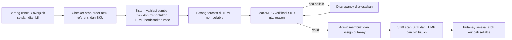

# Rencana Implementasi: Temporary Locator per Zone

## 1. Ringkasan

Fitur ini menangani barang yang **sudah diambil secara fisik dari rak** tetapi belum boleh langsung kembali dijual, misalnya karena pesanan dibatalkan, terjadi overpick, atau koreksi setelah picking/packing.

Barang tersebut dipindahkan ke rak TEMP yang ditentukan berdasarkan zona rak asalnya. Di TEMP, jumlah fisik tetap tercatat, tetapi tidak dapat dipilih untuk pesanan baru dan tidak ikut menjadi stok yang dikirim ke marketplace. Setelah diverifikasi, barang diproses melalui putaway kembali ke rak tujuan dan baru menjadi sellable lagi.

Fitur ini adalah pengembangan baru lintas modul. Ia **bukan** sekadar menambah satu jenis rak atau form scan.

## 2. Masalah yang Diselesaikan

Kondisi saat ini:

- Koreksi picking dan pembatalan yang sudah menyentuh stok fisik mengembalikan stok langsung ke rak asal.
- `PicklistService` melakukan reverse allocation ke bin asal; pembatalan order dan reversal pack juga memakai `StockService::restoreToBin` ke bin asal.
- Sistem sudah mempunyai bin, zone, stock movement, putaway, scan, assignment, serta audit. Namun belum ada status fisik “menunggu verifikasi/putaway” untuk barang cancel atau overpick.

Risikonya adalah barang fisik masih berada di checker/manifest, sementara sistem telah menganggapnya tersedia lagi di rak asal. Picker berikutnya dapat diarahkan ke rak yang sebenarnya belum menerima barang tersebut.

## 3. Tujuan dan Batasan

### Tujuan

1. Barang cancel/overpick yang sudah dipegang fisiknya selalu memiliki lokasi tercatat.
2. Sistem otomatis memilih TEMP berdasarkan zona bin asal atau home bin SKU.
3. Stok TEMP tercatat sebagai stok fisik, tetapi tidak sellable, tidak pickable, dan tidak dipush sebagai stok tersedia ke channel.
4. Pengembalian ke rak dilakukan hanya setelah verifikasi dan putaway berscan.
5. Setiap scan, perubahan qty, approval, dan pergerakan memiliki audit trail.

### Batasan fase pertama

- Berlaku per lokasi/gudang dan dapat diaktifkan atau dimatikan per lokasi.
- Alur sumber: cancel setelah barang diambil, overpick, unpick/koreksi picking, dan reversal packing sebelum handover.
- Barang yang sudah handed over/terkirim tidak masuk alur ini; gunakan alur retur terpisah.
- Tidak memindahkan data transaksi lama otomatis. Barang yang telah bermasalah sebelum go-live harus direkonsiliasi manual.

## 4. Peran dan Hak Akses

| Peran | Hak utama |
| --- | --- |
| Checker/Manifest | Membuat transaksi TEMP, scan SKU/qty, memasukkan alasan; tidak dapat memverifikasi sendiri. |
| Leader/PIC | Melihat antrean, memverifikasi, menolak, atau meminta penyelesaian discrepancy. |
| Admin gudang | Membuat/menugaskan putaway setelah transaksi terverifikasi. |
| Staff putaway | Mengerjakan putaway dengan scan TEMP sebagai sumber dan bin tujuan. |
| Owner/Admin konfigurasi | Mengatur TEMP bin, mapping zone, toggle lokasi, dan melihat audit. |

Checker tidak boleh mengubah hasil scan menjadi “verified”, dan staff putaway tidak boleh memproses transaksi yang belum verified.

## 5. Konfigurasi TEMP per Zone

### Aturan konfigurasi

Setiap rule menghubungkan satu zona asal ke satu bin TEMP dalam lokasi yang sama.

| Zona sumber | Bin TEMP |
| --- | --- |
| A1–A8 / Zone A | TEMP-A |
| A9–A16 / Zone B | TEMP-B |
| B1–B8 / Zone C | TEMP-C |
| B9–B16 / Zone D | TEMP-D |

Implementasi memakai `location_zones` yang telah ada; tidak memakai parsing nama rak sebagai sumber kebenaran. Jika struktur rak berubah, admin cukup memperbarui keanggotaan zone atau rule mapping.

### Validasi rule

- Source zone dan TEMP bin harus berada dalam lokasi yang sama.
- TEMP bin harus aktif, bukan inbound, dan ditandai sebagai `is_temporary`.
- Satu source zone hanya dapat memiliki satu rule aktif.
- Satu TEMP bin boleh melayani beberapa zone bila admin memang memilihnya.
- TEMP bin dapat menampung multi-SKU melalui rule eksplisit; pengecualian ini tidak berlaku bagi bin picking biasa.
- Tidak ada rule atau TEMP bin tidak valid: scan ditolak dan barang tidak boleh dicatat seolah-olah sudah kembali.

## 6. Flow Operasional

### Detail langkah

1. **Identifikasi sumber**
   - Checker memulai dari order/picklist/packlist bila tersedia, lalu scan SKU dan qty.
   - Untuk overpick tanpa order item, checker wajib memilih sumber bin dan alasan; sistem mencatat bahwa itu bukan pelepasan reservasi pesanan.
   - Sistem menggunakan alokasi pick sebagai prioritas untuk mengetahui bin asal. Bila tidak ada, gunakan home bin aktif SKU sebagai fallback yang harus dikonfirmasi checker.

2. **Masuk TEMP**
   - Sistem menentukan zone dari bin asal dan menemukan TEMP bin yang dipetakan.
   - Sistem membuat dokumen Temporary Return dan item scan secara atomik.
   - `on_hand` tercatat pada TEMP sebagai stok fisik; stok tersebut tidak masuk angka sellable.
   - Barang sebelum ada scan fisik tidak boleh dibuat TEMP. Contoh: cancel sebelum proses picking hanya melepaskan reservasi, tanpa transaksi TEMP.

3. **Verifikasi**
   - PIC memeriksa SKU, qty hasil scan, alasan, asal barang, dan TEMP bin.
   - Bila qty kurang/lebih atau SKU tidak cocok, status menjadi discrepancy dan tidak dapat diputaway.
   - Penyelesaian discrepancy harus mencatat keputusan, catatan, dan pelaku. Tidak boleh “dipaksa selesai” tanpa jejak.

4. **Putaway kembali**
   - Hanya transaksi `VERIFIED` yang dapat dibuatkan putaway.
   - Dokumen putaway memakai TEMP sebagai `source_bin_id`; tujuan divalidasi melalui aturan bin/home SKU yang berlaku.
   - Staff scan SKU, qty, dan bin tujuan. Sistem membuat movement keluar TEMP dan masuk bin tujuan dalam satu transaksi.
   - Status selesai hanya jika seluruh qty sudah ditempatkan.

## 7. Status Transaksi

| Status | Makna | Aksi berikutnya |
| --- | --- | --- |
| `TEMP_PENDING` | Dokumen dibuat, scan belum lengkap. | Lanjut scan atau batalkan tanpa pergerakan stok. |
| `WAITING_VERIFICATION` | Semua barang telah masuk TEMP. | Verifikasi PIC. |
| `DISCREPANCY` | SKU/qty/reason bermasalah. | Selesaikan selisih dengan audit. |
| `VERIFIED` | PIC menyetujui qty di TEMP. | Buat/assign putaway. |
| `PUTAWAY_ASSIGNED` | Dokumen putaway telah dibuat/ditugaskan. | Staff mulai putaway. |
| `PUTAWAY_IN_PROGRESS` | Sebagian qty telah dipindahkan dari TEMP. | Selesaikan atau koreksi secara terkontrol. |
| `PUTAWAY_DONE` | Semua qty telah masuk bin tujuan. | Selesai; stok sellable kembali. |
| `CANCELLED` | Dibatalkan sebelum stok masuk TEMP. | Tidak ada stock movement. |

Transisi status harus satu arah, kecuali pembatalan sebelum scan fisik dan koreksi putaway yang memiliki movement reversal eksplisit.

## 8. Aturan Stok yang Wajib Dijaga

### Definisi angka

- **Physical total:** seluruh stok fisik, termasuk bin normal, inbound, dan TEMP.
- **Sellable/available:** hanya stok pada bin picking/placed yang bukan inbound dan bukan TEMP, dikurangi reservasi order.
- **TEMP quantity:** stok fisik yang berada di TEMP dan menunggu verifikasi/putaway.

### Invarian

1. Stok di TEMP tidak boleh menjadi lokasi sumber picking, sale order allocation, replenishment biasa, atau channel stock push.
2. `available` inventory di TEMP selalu nol; `on_order` di TEMP harus nol.
3. Total fisik tidak boleh berubah saat perpindahan normal `asal -> TEMP -> tujuan`.
4. Satu scan yang diulang tidak boleh membuat movement atau qty TEMP ganda.
5. Qty putaway tidak boleh melebihi qty verified yang belum ditempatkan.
6. Barang bundle diproses sebagai komponen fisik, bukan sebagai varian teknis bundle.
7. Bin TEMP tidak boleh diperlakukan sebagai inbound. Menandainya sebagai inbound adalah jalan pintas yang salah karena akan mencampur laporan penerimaan dan lifecycle inbound.

### Penanganan berdasarkan kondisi sumber

| Kondisi | Perlakuan |
| --- | --- |
| Cancel sebelum barang dipick | Lepas reservasi saja; tidak ada TEMP. |
| Barang sudah dipick, belum dipack | Tutup alokasi pick terkait dan pindahkan fisik asal ke TEMP secara atomik. |
| Barang sudah dipack, belum handover | Reversal packing tidak boleh restore langsung ke rak asal; barang dicatat masuk TEMP. |
| Overpick | Pindahkan qty ekstra dari bin sumber ke TEMP; tidak boleh mengubah reservasi order yang bukan miliknya. |
| Cancel setelah handover | Tolak dari fitur TEMP; arahkan ke proses retur. |

## 9. Perubahan Data dan Arsitektur

### Tabel baru

1. `temporary_zone_rules`
   - `id`, `location_id`, `source_zone_id`, `temporary_bin_id`, `is_active`, audit timestamps.
   - Unique: `(location_id, source_zone_id)` untuk rule aktif.

2. `temporary_returns`
   - Nomor dokumen, lokasi, TEMP bin, sumber (`ORDER_CANCEL`, `OVERPICK`, `PICK_CORRECTION`, `PACK_REVERSAL`), referensi order/picklist/packlist nullable, status, reason, notes, checker, verifier, timestamps.

3. `temporary_return_items`
   - Temporary return, SKU/variant, source bin, home bin snapshot, expected qty, scanned qty, verified qty, putaway qty, batch/serial, discrepancy reason, audit timestamps.

### Perubahan tabel/aturan yang ada

- Tambahkan `location_bins.is_temporary` (default `false`) dan constraint bahwa bin TEMP tidak boleh juga inbound.
- Buat `StockBinEligibilityPolicy` sebagai satu sumber aturan: `sellable`, `pickable`, `temporary`, `inbound`.
- Refactor seluruh query stok yang kini hanya memakai `is_inbound = false` agar juga mengecualikan TEMP dari stok placed/sellable. Area utama: `Inventory::isPlaced`, `StockSummary`, repository inventory, daftar bin picking, putaway recommendation, laporan stok, dan resolver stok channel.
- Tambahkan `TEMP_RETURN` ke constraint `putaways.source_type`; dokumen putaway TEMP menyimpan referensi temporary return, bukan inbound source.
- Tambahkan jenis `inventory_movements`: `TEMP_RETURN_OUT`, `TEMP_RETURN_IN`, `TEMP_PUTAWAY_OUT`, `TEMP_PUTAWAY_IN`, dan reversal yang diperlukan.

### ADR ringkas: jangan reuse `is_inbound`

**Keputusan:** TEMP menjadi tipe bin tersendiri (`is_temporary` + policy pusat), bukan `is_inbound=true`.

**Alasan:** saat ini `is_inbound` dipakai untuk pending placement, rekomendasi putaway, perhitungan placed stock, dan laporan penerimaan. Menggunakannya untuk TEMP akan membuat barang cancel terlihat sebagai barang inbound serta menyamarkan kondisi operasional yang berbeda.

**Konsekuensi:** perlu refactor query eligibility di beberapa modul, tetapi data stok dan laporan akan tetap benar dalam jangka panjang.

## 10. Area Kode yang Terdampak

| Area | Kondisi sekarang | Perubahan |
| --- | --- | --- |
| Picking | `PicklistService` membalik alokasi ke bin asal. | Alihkan item fisik yang memenuhi syarat ke TEMP. |
| Cancel order | `SalesOrderService`/`StockService` restore langsung ke bin asal. | Buat Temporary Return atau tetap release-only jika belum ada barang fisik. |
| Packing reversal | `PacklistStockService` restore ke bin asal. | Masukkan ke TEMP bila barang kembali secara fisik. |
| Inventory | `is_inbound` menentukan stok placed/available. | Tambah policy TEMP agar non-sellable dan non-pickable. |
| Putaway | Mendukung `INBOUND` dan `MANUAL`. | Tambah sumber `TEMP_RETURN`, validasi source TEMP, dan referensi dokumen. |
| Warehouse | Zone/bin sudah tersedia. | Tambah konfigurasi TEMP bin dan rule zone-to-TEMP. |
| Channel | Push mengandalkan stok available. | Pastikan TEMP tidak pernah masuk perhitungan/push. |
| Frontend | Belum ada antrean TEMP. | Halaman konfigurasi, checker scan, verifikasi, dan detail/putaway status. |

## 11. API dan Tampilan yang Diperlukan

### Backend API

- CRUD rule TEMP per location/zone.
- Daftar dan detail temporary return dengan filter status, lokasi, reason, tanggal, SKU, order, dan TEMP bin.
- Buat transaksi dari scan checker/manifest.
- Tambah/ulang scan item dengan idempotency key.
- Verifikasi, reject/discrepancy, dan penyelesaian discrepancy.
- Buat dan assign putaway dari temporary return.
- Riwayat audit per dokumen dan per item.

### Frontend

1. **Pengaturan gudang:** tab “Temporary Locator” untuk pilih bin TEMP dan mapping tiap zone.
2. **Checker/Manifest:** halaman scan ringkas: referensi -> SKU -> qty -> alasan -> TEMP tujuan yang disarankan.
3. **Antrean TEMP:** badge jumlah menunggu verifikasi/discrepancy/putaway.
4. **PIC verification:** bandingkan expected, scanned, verified, asal, dan alasan dalam satu tampilan.
5. **Putaway:** gunakan halaman putaway yang ada, dengan label sumber TEMP dan scan source/target yang eksplisit.
6. **Kronologi stok:** tampilkan movement TEMP agar user memahami barang tidak hilang.

## 12. Validasi, Keamanan, dan Ketahanan Data

- Gunakan database transaction dan row lock pada inventory, allocation, temporary return item, serta putaway item.
- Terapkan idempotency untuk scan ulang dari jaringan yang lambat atau tombol yang ditekan dua kali.
- Tolak input jika SKU tidak sesuai order source, TEMP tidak sesuai mapping zone, qty melebihi sumber, atau bin target TEMP/inbound.
- Dokumen aktif untuk item dan sumber yang sama tidak boleh dibuat dua kali tanpa keputusan PIC.
- Rekam actor, waktu, alasan, dan before/after qty pada audit log.
- Tidak boleh ada update stok langsung dari UI; seluruh mutasi harus melalui service inventory dan movement ledger.
- Semua endpoint mengikuti scope location/zone dari hak akses pengguna.

## 13. Test Plan dan Acceptance Criteria

### Test otomatis minimum

1. Cancel sebelum pick hanya melepas reservasi dan tidak membuat TEMP.
2. Cancel setelah pick memindahkan qty tepat satu kali ke TEMP.
3. Overpick dapat masuk TEMP tanpa melepaskan reservasi milik order lain.
4. Pack reversal tidak mengembalikan langsung ke bin asal saat TEMP aktif.
5. TEMP tidak muncul pada daftar bin pickable, stok available, bundle availability, atau payload push channel.
6. TEMP tetap masuk physical total dan kronologi stok.
7. PIC tidak dapat verify jika qty/sku tidak sesuai tanpa resolution.
8. Putaway tidak dapat dibuat sebelum verified dan tidak dapat melebihi qty belum ditempatkan.
9. Scan ulang dan retry request tidak menggandakan movement.
10. Semua movement asal-TEMP-tujuan seimbang; tidak ada stok negatif atau selisih fisik.
11. Hak akses checker, PIC, admin, dan putaway staff dipisahkan.
12. Feature toggle lokasi off mempertahankan perilaku lama secara eksplisit.

### Acceptance operasional

- User dapat melihat lokasi TEMP barang kapan pun.
- Picker tidak pernah diarahkan ke stok yang masih berada di TEMP.
- PIC dapat menelusuri siapa yang scan, verifikasi, dan putaway.
- Setelah putaway selesai, stok dan push channel menggunakan angka yang benar tanpa tindakan manual tambahan.

## 14. Rollout

1. Buat migration, policy bin, dan test unit/feature tanpa mengaktifkan feature flag.
2. Konfigurasi TEMP bin dan rule zone pada satu gudang pilot.
3. Lakukan simulation cancel-after-pick, overpick, discrepancy, dan putaway dengan SKU non-kritis.
4. Audit movement dan angka available/physical total sebelum mengaktifkan untuk operasi harian.
5. Aktifkan per lokasi secara bertahap; pantau antrean TEMP dan failed job/log selama minggu pertama.
6. Siapkan prosedur rollback: nonaktifkan feature per lokasi untuk transaksi baru; transaksi TEMP yang sudah terbuka tetap wajib ditutup melalui proses yang aman, bukan dihapus.

## 15. Estimasi Implementasi

Dengan fondasi WMS saat ini, pekerjaan bukan rewrite, tetapi melintasi beberapa modul kritis. Estimasi realistis:

- Analisis detail, migration, policy stok: 2–3 hari kerja.
- Backend transaction, API, permissions, audit: 4–6 hari kerja.
- Frontend konfigurasi dan workflow: 3–4 hari kerja.
- Test regresi stok, channel, dan UAT pilot: 3–4 hari kerja.

Total: **12–17 hari kerja** tergantung jumlah variasi cancel/overpick yang harus masuk fase pertama dan hasil UAT gudang.

## 16. Keputusan yang Harus Disetujui Sebelum Implementasi

1. Apakah TEMP berlaku otomatis untuk semua cancel fisik, atau checker memilih “masuk TEMP” secara manual?
2. Apakah satu TEMP bin boleh multi-SKU? Rekomendasi: ya, dengan scan wajib dan pencatatan detail.
3. Apakah PIC boleh memverifikasi qty parsial lalu putaway sebagian? Rekomendasi: ya, dengan status `PUTAWAY_IN_PROGRESS`.
4. Alasan mana yang wajib: `CANCEL`, `OVERPICK`, `PICK_CORRECTION`, `PACK_REVERSAL`, dan `OTHER` dengan catatan wajib.
5. Apakah barang damaged/defect masuk TEMP yang sama? Rekomendasi: tidak; gunakan bin quarantine/stock adjustment terpisah.
6. Lokasi pilot dan daftar bin TEMP pertama yang akan dipakai.
